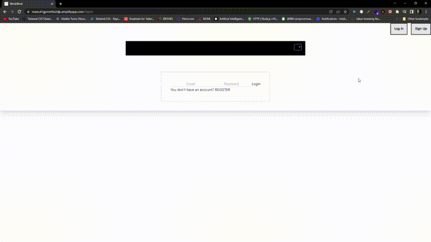

</br>
</br>
</br>
</br>

<div id="top"></div>
<!--
*** Thanks for checking out the Best-README-Template. If you have a suggestion
*** that would make this better, please fork the repo and create a pull request
*** or simply open an issue with the tag "enhancement".
*** Don't forget to give the project a star!
*** Thanks again! Now go create something AMAZING! :D
-->


<!-- PROJECT SHIELDS -->
<!--
*** I'm using markdown "reference style" links for readability.
*** Reference links are enclosed in brackets [ ] instead of parentheses ( ).
*** See the bottom of this document for the declaration of the reference variables
*** for contributors-url, forks-url, etc. This is an optional, concise syntax you may use.
*** https://www.markdownguide.org/basic-syntax/#reference-style-links
-->
<!-- [![Contributors][contributors-shield]][contributors-url]
[![Forks][forks-shield]][forks-url]
[![Stargazers][stars-shield]][stars-url]
[![Issues][issues-shield]][issues-url]
[![MIT License][license-shield]][license-url]
[![LinkedIn][linkedin-shield]][linkedin-url] -->

 


<br />
<div align="center">
  <a href="https://github.com/othneildrew/Best-README-Template">
    <p align="center">
</p>  
  </a>

 
   <br />
    <a href="https://main.d1gjrmtr0a2djk.amplifyapp.com/">View Demo</a>
    ·
  
   </p>
</div>


<!-- TABLE OF CONTENTS -->

&#8595;

   
   * For easy testing use these credentials

    test_example@gmail.com////1234567    

<!-- ABOUT THE PROJECT -->
### About
</br>
</br>
</br>
 

 * Nutrient calculator showing different data as percentage on dougnut chart based on plugins


</br>
</br>
</br>


<!-- USAGE EXAMPLES -->

### Built With

```js
const USED = {
  "name": "Nutri-frontend",
  "version": "0.1.0",
  "private": true,
  "dependencies": {
    "@headlessui/react": "^1.5.0",
    "@heroicons/react": "^1.0.6",
    "@react-three/fiber": "^7.0.26",
    "@testing-library/jest-dom": "^5.16.2",
    "@testing-library/react": "^12.1.3",
    "@testing-library/user-event": "^13.5.0",
    "axios": "^0.26.1",
    "chart.js": "^3.7.1",
    "chart.js-plugin-labels-dv": "^3.0.6",
    "chartjs-plugin-datalabels": "^2.0.0-rc.1",
    "chartjs-plugin-doughnut-innertext": "^3.1.0",
    "chartjs-plugin-streaming": "^1.8.0",
    "chartjs-plugin-zoom": "^1.2.1",
    "jwt-decode": "^3.1.2",
    "moment": "^2.29.1",
    "react": "^17.0.2",
    "react-chartjs-2": "^4.1.0",
    "react-charts": "^3.0.0-beta.33",
    "react-dom": "^17.0.2",
    "react-router-dom": "^6.2.1",
    "react-scripts": "5.0.0",
    "tailwind-scrollbar-hide": "^1.1.7",
    "web-vitals": "^2.1.4",
    "websocket": "^1.0.34"
  },
    "devDependencies": {
    "autoprefixer": "^10.4.2",
    "chartjs-plugin-gradient": "^0.5.0",
    "postcss": "^8.4.6",
    "tailwindcss": "^3.0.23"
  }
``` 
<!-- ROADMAP -->


<!-- CONTACT -->


<!-- ACKNOWLEDGMENTS -->
### Acknowledgments

Use this space to list resources you find helpful and would like to give credit to. I've included a few of my favorites to kick things off!

* [React-chart-js-2](https://react-chartjs-2.js.org/)
* [chartjs-plugin-datalabels](https://chartjs-plugin-datalabels.netlify.app/guide/)
* [ChartJs](https://www.chartjs.org/)

<p align="right">(<a href="#top">back to top</a>)</p>


<!-- MARKDOWN LINKS & IMAGES -->
<!-- https://www.markdownguide.org/basic-syntax/#reference-style-links -->
[contributors-shield]: https://img.shields.io/github/contributors/othneildrew/Best-README-Template.svg?style=for-the-badge
[contributors-url]: https://github.com/othneildrew/Best-README-Template/graphs/contributors
[forks-shield]: https://img.shields.io/github/forks/othneildrew/Best-README-Template.svg?style=for-the-badge
[forks-url]: https://github.com/othneildrew/Best-README-Template/network/members
[stars-shield]: https://img.shields.io/github/stars/othneildrew/Best-README-Template.svg?style=for-the-badge
[stars-url]: https://github.com/othneildrew/Best-README-Template/stargazers
[issues-shield]: https://img.shields.io/github/issues/othneildrew/Best-README-Template.svg?style=for-the-badge
[issues-url]: https://github.com/othneildrew/Best-README-Template/issues
[license-shield]: https://img.shields.io/github/license/othneildrew/Best-README-Template.svg?style=for-the-badge
[license-url]: https://github.com/othneildrew/Best-README-Template/blob/master/LICENSE.txt
[linkedin-shield]: https://img.shields.io/badge/-LinkedIn-black.svg?style=for-the-badge&logo=linkedin&colorB=555
[linkedin-url]: https://linkedin.com/in/othneildrew
[product-screenshot]: images/screenshot.png